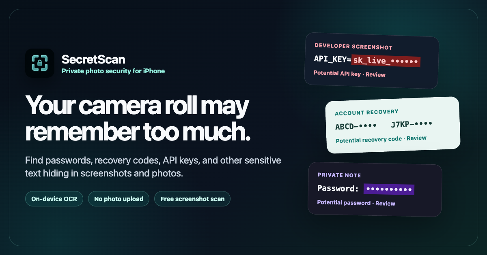

# SecretScan — private screenshot and photo security for iPhone

SecretScan helps you find passwords, recovery codes, API keys, payment details, IDs, and other sensitive text that was left behind in screenshots and photos.



- OCR and detection run on the iPhone or iPad.
- Photos and extracted text are not uploaded to SecretScan servers.
- Review likely findings behind device authentication.
- Save a redacted copy or delete the original after review.
- Start with a free screenshot scan; Lifetime Pro is a one-time purchase.

[Download SecretScan on the App Store](https://apps.apple.com/app/apple-store/id6763880476?pt=120611987&ct=github_repo_sep2&mt=8) · [Visit the website](https://mityapolianskii.github.io/secretscan-app-store-pages/) · [Open the press kit](https://mityapolianskii.github.io/secretscan-app-store-pages/press.html) · [Follow the guide feed](https://mityapolianskii.github.io/secretscan-app-store-pages/feed.xml) · [Read the privacy policy](https://mityapolianskii.github.io/secretscan-app-store-pages/privacy.html)

## Practical privacy guides

- [All iPhone photo privacy guides](https://mityapolianskii.github.io/secretscan-app-store-pages/guides.html)
- [How to find and remove sensitive screenshots on iPhone](https://mityapolianskii.github.io/secretscan-app-store-pages/iphone-sensitive-screenshot-checklist.html)
  - [Español](https://mityapolianskii.github.io/secretscan-app-store-pages/es/eliminar-capturas-sensibles-iphone.html)
  - [Deutsch](https://mityapolianskii.github.io/secretscan-app-store-pages/de/sensible-screenshots-iphone-finden-loeschen.html)
  - [Русский](https://mityapolianskii.github.io/secretscan-app-store-pages/ru/nayti-udalit-chuvstvitelnye-skrinshoty-iphone.html)
- [Shared a sensitive screenshot? Check what to do next](https://mityapolianskii.github.io/secretscan-app-store-pages/screenshot-exposure-check.html)
  - [Español](https://mityapolianskii.github.io/secretscan-app-store-pages/es/revisar-captura-sensible.html)
  - [Deutsch](https://mityapolianskii.github.io/secretscan-app-store-pages/de/geteilten-screenshot-pruefen.html)
  - [Русский](https://mityapolianskii.github.io/secretscan-app-store-pages/ru/proverit-otpravlennyy-skrinshot.html)
- [How to search screenshots by text on iPhone](https://mityapolianskii.github.io/secretscan-app-store-pages/search-screenshots-by-text-iphone.html)
  - [Español](https://mityapolianskii.github.io/secretscan-app-store-pages/es/buscar-capturas-texto-iphone.html)
  - [Deutsch](https://mityapolianskii.github.io/secretscan-app-store-pages/de/iphone-screenshots-nach-text-suchen.html)
  - [Русский](https://mityapolianskii.github.io/secretscan-app-store-pages/ru/poisk-skrinshotov-po-tekstu-iphone.html)
- [Check which apps can access your iPhone photos](https://mityapolianskii.github.io/secretscan-app-store-pages/check-which-apps-access-iphone-photos.html)
- [Find API keys and tokens in iPhone screenshots](https://mityapolianskii.github.io/secretscan-app-store-pages/scan-api-keys-in-screenshots.html)
- [Find recovery codes and seed phrases in photos](https://mityapolianskii.github.io/secretscan-app-store-pages/find-recovery-codes-in-photos.html)
- [Find password screenshots and photos on iPhone](https://mityapolianskii.github.io/secretscan-app-store-pages/find-passwords-in-iphone-photos.html)
  - [Español](https://mityapolianskii.github.io/secretscan-app-store-pages/es/encontrar-contrasenas-fotos-iphone.html)
  - [Deutsch](https://mityapolianskii.github.io/secretscan-app-store-pages/de/passwoerter-in-iphone-fotos-finden.html)
  - [Русский](https://mityapolianskii.github.io/secretscan-app-store-pages/ru/nayti-paroli-v-foto-iphone.html)
- [Find credit card screenshots and photos on iPhone](https://mityapolianskii.github.io/secretscan-app-store-pages/find-credit-card-photos-iphone.html)
- [Find passport and ID photos on iPhone](https://mityapolianskii.github.io/secretscan-app-store-pages/find-passport-id-photos-iphone.html)

SecretScan is a focused photo-privacy audit, not a cloud vault, antivirus, password manager, or guarantee that every sensitive image will be found. If a credential may have been exposed, rotate or revoke it; deleting its screenshot does not invalidate it.

## Website source

Static pages for App Store Connect URLs:

- `index.html`: English acquisition homepage.
- `es/index.html`, `de/index.html`, and `ru/index.html`: focused localized homepages with reciprocal `hreflang` and distinct App Store campaigns.
- `es/apps-acceso-fotos-iphone.html`, `de/apps-zugriff-iphone-fotos.html`, and `ru/dostup-prilozheniy-k-foto-iphone.html`: localized Photos-permission guides with reciprocal `hreflang` and distinct App Store campaigns.
- `es/encontrar-contrasenas-fotos-iphone.html`, `de/passwoerter-in-iphone-fotos-finden.html`, and `ru/nayti-paroli-v-foto-iphone.html`: localized password-photo guides with reciprocal `hreflang`, localized Apple sources, and distinct App Store campaigns.
- `es/buscar-capturas-texto-iphone.html`, `de/iphone-screenshots-nach-text-suchen.html`, and `ru/poisk-skrinshotov-po-tekstu-iphone.html`: localized screenshot-text search guides with reciprocal `hreflang`, localized Apple sources, and distinct App Store campaigns.
- `es/eliminar-capturas-sensibles-iphone.html`, `de/sensible-screenshots-iphone-finden-loeschen.html`, and `ru/nayti-udalit-chuvstvitelnye-skrinshoty-iphone.html`: localized sensitive-screenshot checklists with reciprocal `hreflang`, localized primary sources, and distinct App Store campaigns.
- `privacy.html`: Privacy Policy URL.
- `support.html`: Support URL.
- `scan-api-keys-in-screenshots.html`: developer-intent acquisition page.
- `find-recovery-codes-in-photos.html`: account-recovery intent acquisition page.
- `find-passwords-in-iphone-photos.html`: password-screenshot intent guide and cleanup path.
- `find-credit-card-photos-iphone.html`: payment-card image search, private detector boundaries, and issuer-response guide.
- `find-passport-id-photos-iphone.html`: passport and identity-document photo audit guide.
- `iphone-sensitive-screenshot-checklist.html`: English member of the four-language evergreen manual-audit cluster.
- `search-screenshots-by-text-iphone.html`: built-in Photos and Spotlight text-search guide.
- `redact-sensitive-information-iphone-screenshot.html`: built-in Markup redaction guide and reversible-edit caveat.
- `remove-location-from-iphone-photos.html`: built-in Photos location-metadata guide and product-boundary note.
- `check-which-apps-access-iphone-photos.html`: built-in Photos permission audit, App Privacy Report guidance, and device-access boundary note.
- `screenshot-exposure-check.html`, `es/revisar-captura-sensible.html`, `de/geteilten-screenshot-pruefen.html`, `ru/proverit-otpravlennyy-skrinshot.html`, and `assets/exposure-check.js`: localized, local-only screenshot exposure triage with reciprocal `hreflang`, separate App Store campaigns, and no sensitive input, upload, persistence, analytics, or post-load network request.
- `mac-private-file-scan.html`: Mac demand-validation page.
- `guides.html`: crawlable guide hub with an eleven-item structured index and a distinct App Store campaign.
- `press.html`: verified product facts, privacy boundaries, story angles, contact details, and downloadable public artwork.
- `robots.txt`, `sitemap.xml`, and `sitemap.txt`: crawl discovery, with a plain-text sitemap fallback for crawlers that fail to process the XML sitemap.
- `feed.xml`: Atom feed for guide and tool discovery without analytics or user tracking.
- `llms.txt`: concise product boundaries and canonical sources for AI-assisted discovery.
- `53e8f1b23307486a8c13ea79ed325d80.txt`: IndexNow ownership key for URLs under this GitHub Pages path.
- `assets/og-card-source.html` and `assets/og-card.png`: reproducible 1200×630 social preview.
- `assets/og-card-es-source.html`, `assets/og-card-de-source.html`, and `assets/og-card-ru-source.html`: reproducible localized 1200×630 social previews and their matching PNG files.
- `assets/exposure-check-card-source.html` and `assets/exposure-check-card.png`: reproducible tool-specific 1200×630 social preview.

## Preview

```sh
cd app-store-pages
python3 -m http.server 4173
```

Open `http://127.0.0.1:4173`.

## Publish

These files can be published on any static host, including GitHub Pages, Cloudflare Pages, Netlify, or a normal web server.

The published support contact is `liweba@gmail.com`.
